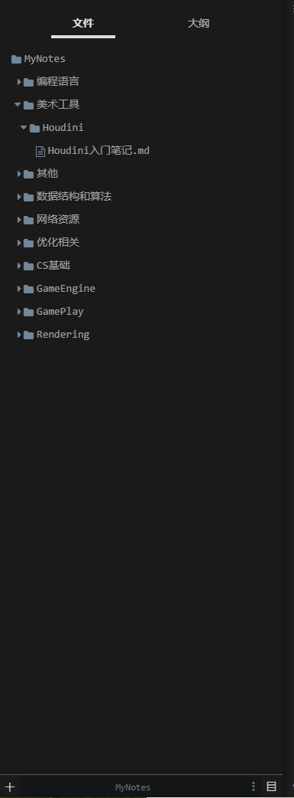
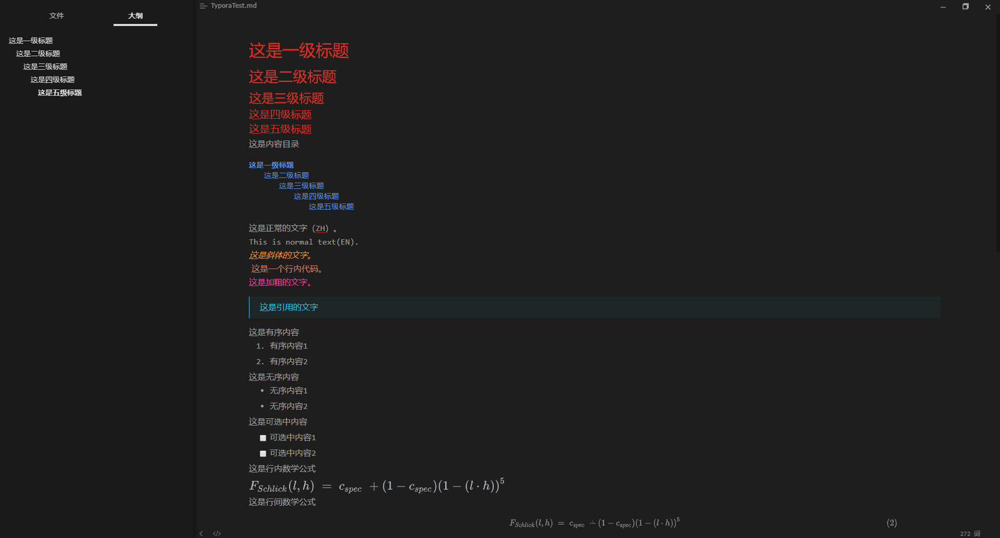
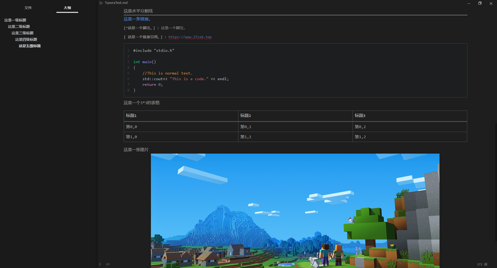

# MyTyporaTheme
我的Typora主题备份，基于barfi魔改。

## 如何使用

### 字体相关配置

打开Typora的conf.user.json文件，例如`C:\Users\Administrator\AppData\Roaming\Typora\conf\conf.user.json`

将其内容替换为

```json
/* C:\Users\Administrator\AppData\Roaming\Typora\conf\conf.user.json */
/** For advanced users. */
{
  "defaultFontFamily": {
    "standard": "Microsoft Yahei", //String - Defaults to "Times New Roman".
    "serif": "Microsoft Yahei", // String - Defaults to "Times New Roman".
    "sansSerif": "Consolas", // String - Defaults to "Arial".
    "monospace": "Consolas" // String - Defaults to "Courier New".
  },
  "autoHideMenuBar": false, //Boolean - Auto hide the menu bar unless the `Alt` key is pressed. Default is false.

  // Array - Search Service user can access from context menu after a range of text is selected. Each item is formatted as [caption, url]
  "searchService": [    ["Search with Google", "https://google.com/search?q=%s"]
  ],

  // Custom key binding, which will override the default ones.
  "keyBinding": {
    // for example: 
    // "Always on Top": "Ctrl+Shift+P"
  },

  "monocolorEmoji": false, //default false. Only work for Windows
  "autoSaveTimer" : 3, // Deprecidated, Typora will do auto save automatically. default 3 minutes
  "maxFetchCountOnFileList": 500
}
```

### 进行安装

将此项目中的`barfi文件夹`与`barfi.css`文件放入Typora的主题目录（例如 `C:\Users\Administrator\AppData\Roaming\Typora\themes`）

## 效果





